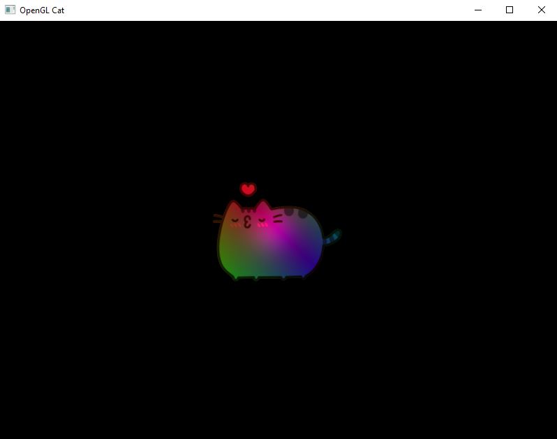

[]()
# GLSL Cat Renderer

# 🐱 GLSL Cat Renderer | OpenGL 4.4 Core



## 🔥 Features
- **lighting**: 
  - Ambient occlusion
  - Diffuse scattering
  - Specular highlights (RGB reflections)
- **Interactive controls**:
  - Rotate
  - Move
  - Flip vertically
  - resizing
- **Perspective camera**
- **Texture loading** via SOIL2
- **Matrix transformations** powered by GLM

## ⚙️ Tech Stack
| Component       | Technology     |
|-----------------|----------------|
| Graphics API    | OpenGL 4.4 Core|
| Math Library    | GLM            |
| Window/Input    | GLFW 3.3+      |
| Loader          | Glad           |
| Image Loading   | SOIL2          |
| Language        | C++17          |

## 🚀 Building & Running
```bash
# Clone The Project
git clone https://github.com/yourusername/opengl-cat.git

# Build (CMake required)
mkdir build
cd build
cmake ..
cmake --build .

# Run the Program!
../bin/GL-Cat
```
For **MSVC** Compiler, You Need SOIL2 And GLFW Installed, Otherwise it Won't Work


For Executable Program For Windows User, Check out The [Releases](https://github.com/SalaxDev/GL4-Cat/releases)

**NOTE That** Anti Virus Might Give Malware Warnings For Direct Download cause Program Not **Signed**
